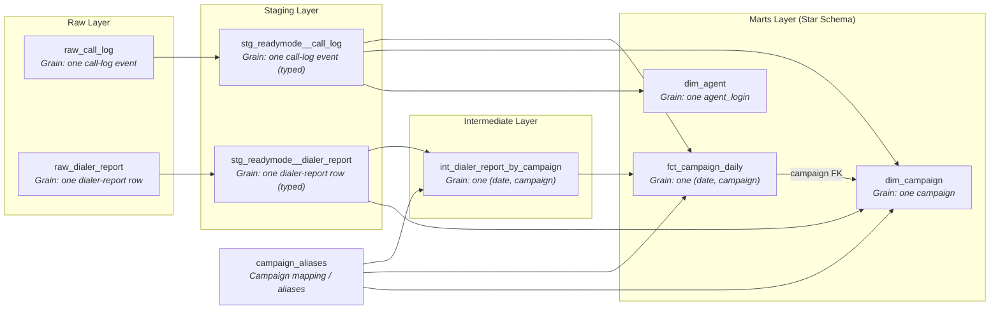
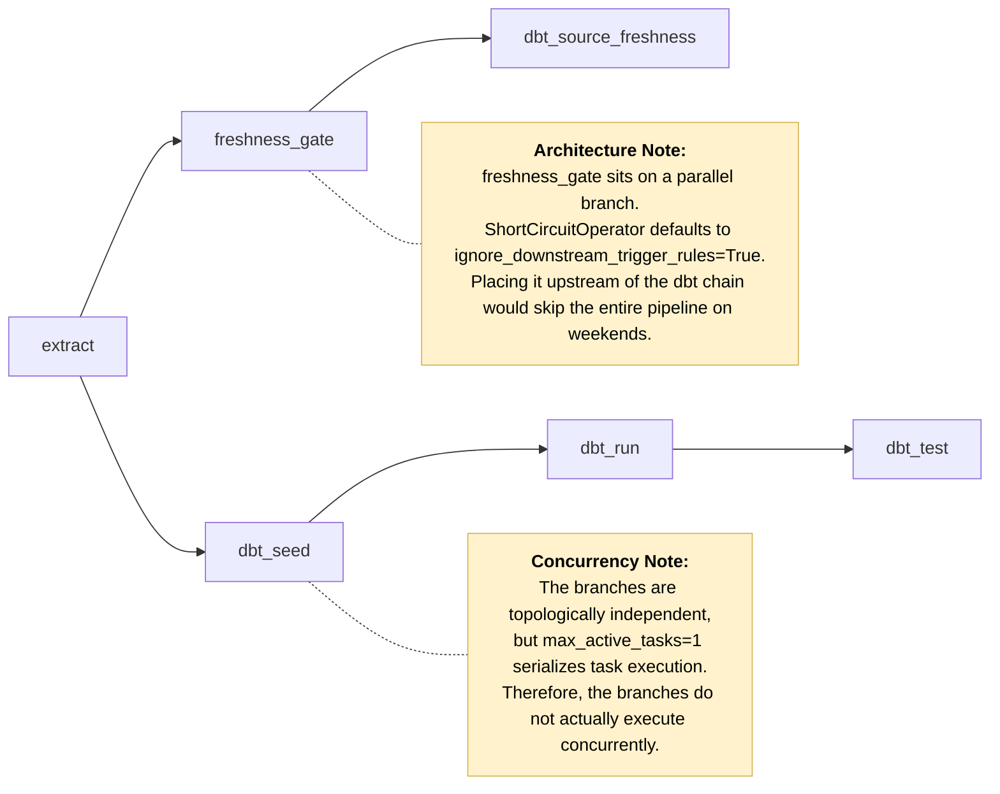
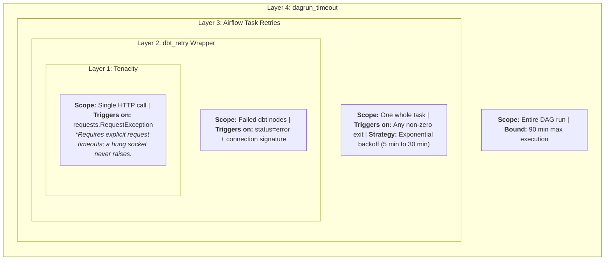

# dialer-dw architecture

Three diagrams, each answering a different question: what the model is, how it
runs, and what happens when it breaks.

## 1. Lineage — Data Flow & Granularity

The call log bypasses the intermediate layer and joins the fact directly — which
is why `fct_campaign_daily` is a FULL OUTER JOIN rather than a simple aggregate.

`dim_campaign` is built from staging and the seed, never from the fact. Were it
derived from the fact, the `relationships` test between them could not fail.

`dim_agent`'s foreign key is not drawn: its `relationships` test is on
`stg_readymode__call_log.agent_login`, and that node pair already carries a
lineage edge — the dimension is built from the same table that references it.

## 2. DAG Task Graph — Execution Flow

## 3. Resilience Layers — Fault Isolation

Each layer catches what the one inside it could not, at increasing cost. A
dropped query is absorbed in seconds by layer 2; a dead process costs a layer-3
retry and minutes. A `status=fail` — data that is genuinely wrong — is retried by
none of them and fails immediately.
